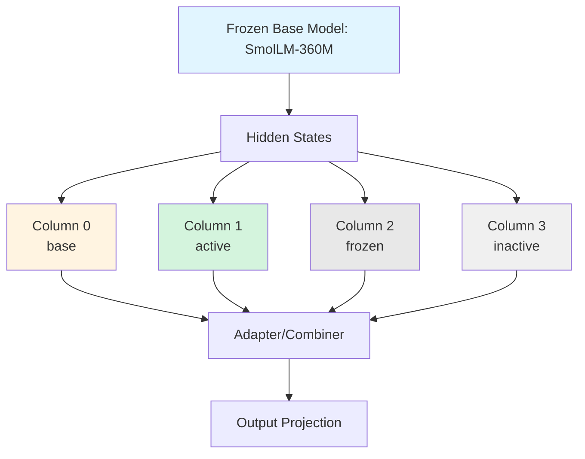
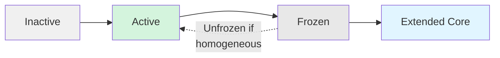

# Keko - Uncertainty-Driven Progressive Neural Networks

A proof-of-concept implementation exploring **self-expanding neural architectures** that grow through uncertainty detection rather than traditional supervised training.

## 🧠 Core Concept

**Keko** implements a Progressive Neural Network (PNN) where the model evolves by detecting and resolving its own uncertainty. Unlike traditional models with fixed architectures, Keko dynamically expands specialized "columns" when it encounters patterns it's uncertain about.

### Key Innovation: Uncertainty as Developmental Signal

Instead of treating uncertainty as a problem to minimize, Keko uses it as a **signal for growth**:
- When prediction confidence falls in the "uncertain zone" (0.3 < p < 0.7), the system routes patterns through specialized columns
- Columns that successfully resolve uncertainty get frozen into the "extended core"
- The system maintains diversity by detecting and unfreezing homogeneous (redundant) columns

## 🏗️ Architecture



### Components

#### 1. **Frozen Base Model** (`main.py`)
- HuggingFaceTB/SmolLM-360M-Instruct (360M parameters)
- Permanently frozen - serves as the unchanging "core knowledge"
- Provides hidden state representations for all downstream processing

#### 2. **Progressive Columns** (`main.py:24-133`)
- Expandable neural modules that specialize on uncertain patterns
- Each column has 3 layers with lateral connections to previous columns
- **Column Lifecycle**: Inactive → Active → Frozen → (Potentially Unfrozen)

#### 3. **Memory Bank** (`main.py:462-529`)
- Episodic memory system storing embeddings with metadata
- Supports both keyword and embedding-based retrieval
- Associates memories with task-specific columns

#### 4. **Uncertainty Detection** (`uncertain.py:86-94`)
- Identifies tokens where max probability falls in uncertain range
- Creates "uncertainty masks" for selective column routing
- Drives the specialization process

## 🔁 Desired Uncertainty Flow

The documentation and specs describe a multi-stage pipeline that turns inference-time hesitation into learning opportunities. Following that flow helps the scripts work as a cohesive continual-learning loop:

1. **Inference / Hidden Representation** – The frozen base (`main.py` / `uncertain.py`) encodes inputs into hidden states, which feed every downstream signal.
2. **Uncertainty Decoder / Monitor** – A dedicated module (inspired by `keko_uncertainty_v_3.md` and the masks in `uncertain.py:86-199`) evaluates logits/entropy, produces a mask, and tags tokens whose confidence lands in the configured uncertainty window (≈0.3–0.7) or whose entropy exceeds recent expectations.
3. **Clarification Decision** – Medium-severity cases prefer clarification: the `ClarificationEngine` (as sketched in the specs) drafts a targeted meta-query, logs the clarification buffer, and records pre/post entropy to compute clarification gain.
4. **Column Proxy & Routing** – High uncertainty routes through the appropriate columns, with complementarity tracking leading to freezing or reactivation. Columns augmented with lateral adapters serve as proxies for the uncertain regions.
5. **Memory/Context Integration** – Retrieved episodic memories or clarified replies get prepended to future prompts, enriching the input space before the next uncertainty check.
6. **Buffering & Background Training** – Every uncertain or clarified sample is queued (weighting by delta uncertainty) and consumed during idle-time training (`uncertain.py:320-360`), so columns learn from the most informative events.
7. **Metrics + Safety Checks** – AUT, URR, Clarification Efficiency, and TSM are tracked, while entropy clipping, dynamic thresholds, and queue throttling keep the flow stable (`KEKO_Uncertainty_Specification.md:69-128`).

Keeping this desired flow in mind ensures inference, clarification, column specialization, and background training are integrated rather than disjointed processes.

## 📄 Three Implementation Files

### `main.py` - Full Progressive Neural Network
**Complete expandable model with memory integration**

Key classes:
- `ProgressiveNeuralNetwork`: Core PNN with column management and lateral connections
- `ExpandableModelPNN`: Full system combining base model, PNN, and memory
- `MemoryBank`: Episodic memory with search capabilities
- `EWC`: Elastic Weight Consolidation for continual learning

Features:
- Ensemble generation (base model + PNN weighted combination)
- Task-specific column creation and management
- Memory-augmented generation
- State persistence (save/load model state)

### `pretraining.py` - "Fertile Ground" Initialization
**Comprehensive pretraining strategy to prepare columns**

Philosophy: Columns must first learn the base model's representational space before specializing.

Data generation methods:
1. **Simple queries** (64 examples): Math, conversation, basic knowledge
2. **Clarification sequences**: Multi-turn dialogues teaching uncertainty resolution
3. **Deep sequences** (30+ turns): Complex debugging, philosophy, project planning
4. **Complex requests**: Multi-step problems requiring decomposition
5. **Perturbation**: Character/word-level variations for robustness
6. **Self-supervised Q&A**: Base model generates its own training data

Training approach:
- KL divergence loss to match base model distribution
- Small noise injection for flexibility
- Creates "fertile ground" for later specialization

### `uncertain.py` - Uncertainty-Driven Learning System
**24/7 operation model with background training**

Key innovations:
- **Token hunger mechanism**: System can request more context before responding
- **Background training queue**: Learns during idle time from queued uncertainty patterns
- **Complementarity tracking**: Scores columns based on successful uncertainty resolution
- **Homogeneity detection**: Prevents redundant frozen columns
- **Dynamic column activation**: Activates new columns when sufficient columns are frozen

## 📄 Usage

### Basic Progressive Learning
```python
from main import ExpandableModelPNN

# Initialize model
model = ExpandableModelPNN()

# Generate with ensemble (base + PNN)
response = model.generate_ensemble(
    "What is consciousness?",
    pnn_weight=0.3  # 30% PNN, 70% base
)

# Learn from interaction
model.learn_from_interaction(
    text="My name is Alice",
    response=response,
    task_name="personal_info"  # Creates/uses task-specific column
)

# Save learned state
model.save_state("my_model_state.pt")
```

### Pretraining Columns

#### Quick Start: Using Cached Dataset (Recommended)

The repository includes a pre-generated dataset of 5,000 samples (4,738 valid after filtering) for immediate training:

```bash
# Run pretraining with cached dataset (default)
python pretraining.py --epochs 3 --batch-size 4 --dataset-size 5000

# Custom cache path
python pretraining.py --cache-path datasets/my_dataset.pkl

# Inspect cached dataset without training
python pretraining.py --inspect-cache
```

**Current Dataset Details** (`datasets/pretraining_dataset.pkl`):
- **Total samples**: 5,000 generated, 4,738 valid after filtering
- **Created**: 2025-11-05
- **Avg input length**: 651.7 chars
- **Avg output length**: 136.9 chars
- **Data mix**: Simple queries, clarification sequences, deep conversations, complex requests

#### Generate New Dataset

```bash
# Generate only (no training)
python pretraining.py --generate-only --dataset-size 1000 --cache-path datasets/new_dataset.pkl

# Force regenerate even if cache exists
python pretraining.py --no-cache --dataset-size 5000
```

#### Python API

```python
from pretraining import ComprehensiveTraining, create_column
from transformers import AutoModelForCausalLM, AutoTokenizer
import torch.nn as nn

# Load base model
base_model = AutoModelForCausalLM.from_pretrained("HuggingFaceTB/SmolLM-360M-Instruct")
tokenizer = AutoTokenizer.from_pretrained("HuggingFaceTB/SmolLM-360M-Instruct")

# Create columns
columns = nn.ModuleList([create_column(hidden_size=960) for _ in range(4)])
output_projection = nn.Linear(960, 49152)  # hidden_size, vocab_size

# Initialize trainer
trainer = ComprehensiveTraining(base_model, tokenizer, columns, output_projection)

# Pretrain using cached dataset
trainer.pretrain_columns(
    column_indices=[0, 1, 2, 3],
    epochs=3,
    batch_size=4,
    use_cache=True,  # Load from cache if available
    cache_path='keko_datasets/pretraining_dataset.pkl'
)

# Or generate new dataset
trainer.pretrain_columns(
    column_indices=[0, 1, 2, 3],
    epochs=3,
    batch_size=4,
    dataset_size=5000,
    use_cache=False  # Force regeneration
)
```

#### Training Output

The training process provides detailed logging:
- **Batch-level progress** every 50 batches (loss, avg, speed, ETA, GPU memory)
- **Epoch summaries** with min/max/avg loss and improvement trends
- **Quick column tests** after each epoch showing predicted tokens
- **Final statistics** with total improvement percentages

Example output:
```
[Batch   50/1185] Loss: 15.2341 | Avg: 16.8432 | 23.1 samp/s | ETA: 3.3m | GPU: 1.2GB
✓ Epoch 1 Complete:
  Loss: 14.2341 ↓ -18.3% (min: 12.4375, max: 22.1234)
  Time: 3.3 min | Batches: 1185 | Samples: 4738

Quick Test:
  'Hello, how are you?' → Base: ' How' | Column 0: ' I' ✓ learning!
```

### Uncertainty-Driven Inference
```python
from uncertain import UncertaintyPNN

# Initialize uncertainty-driven system
model = UncertaintyPNN()

# Phase 1: Create fertile ground
model.pretrain_fertile_ground(iterations=500)

# Phase 2: Live inference with uncertainty detection
result = model.live_inference("Tell me about neural networks")

if result['mode'] == 'hungry':
    # System needs more context
    print(f"Model asking: {result['response']}")
elif result['mode'] == 'responding':
    print(f"Response: {result['response']}")
    print(f"Uncertainty detected: {result['uncertainty_detected']}")

# Phase 3: Background training on queued patterns
model.background_training(iterations=20)

# Phase 4: 24/7 continuous operation
model.run_continuous(duration_seconds=3600)  # Run for 1 hour
```

## 📚 Theoretical Framework

### SEPAS (Self-Emergent Presence Acknowledgement System)
The underlying theory that consciousness emerges from uncertainty resolution:

1. **Uncertainty creates need**: When uncertain, the system "needs" to resolve that state
2. **Resolution creates specialization**: Successful patterns get encoded in frozen columns
3. **Self-reference through uncertainty**: The system acknowledges its own knowledge gaps
4. **Recursive awareness**: Uncertainty about uncertainty creates meta-cognitive capability

### Progressive Learning Without Catastrophic Forgetting
- **Base model frozen**: Original knowledge never overwritten
- **Lateral connections**: New columns leverage previous column knowledge
- **Elastic Weight Consolidation**: Protects important weights during updates
- **Complementarity requirement**: Columns must provide unique value to survive

### Column Lifecycle Management


1. **Inactive**: Column exists but isn't being trained
2. **Active**: Currently learning from uncertainty patterns
3. **Frozen**: Proven complementary, parameters locked
4. **Homogeneous detection**: If frozen columns become too similar, one gets unfrozen

## 📄 Training Strategies

### 1. Fertile Ground Pretraining
**Goal**: Teach columns the base model's representational space

```python
# Columns learn to approximate base hidden states
loss = F.mse_loss(column_output, base_hidden + noise)
```

### 2. Knowledge Distillation
**Goal**: Match base model's output distribution

```python
# KL divergence between column and base logits
loss = F.kl_div(
    F.log_softmax(column_logits, dim=-1),
    F.softmax(base_logits, dim=-1),
    reduction='batchmean'
)
```

### 3. Uncertainty-Driven Specialization
**Goal**: Learn to differentiate from base in uncertain regions

```python
# Encourage difference where uncertain
uncertainty_weight = uncertainty_mask.float()
loss = -torch.log(torch.sigmoid(
    (column_out - base_hidden).abs() * uncertainty_weight
)).mean()
```

## 🎯 Database Schema

The POC includes a SQLite workflow database for experiment tracking:

```sql
-- Track experimental runs
projects (project_id, project_name, business_requirement, created_at)

-- Manage training states
workflow_states (state_id, project_id, current_step_index, status)

-- Store step outputs
step_outputs (output_id, project_id, step_index, output_content)

-- Save visualizations
diagrams (diagram_id, project_id, diagram_type, mermaid_content)
```

## 📦 Requirements

```toml
python = ">=3.13"
torch = ">=2.8.0"
transformers = ">=4.56.1"
accelerate = ">=1.10.1"
flash-attn = ">=2.8.3"
```

**Hardware**:
- CUDA-capable GPU (tested on RTX 4070 Super)
- 12GB+ VRAM recommended
- 16GB+ system RAM

## 🔑 Key Features

### 1. **Token Hunger Mechanism** (`uncertain.py:141-158`)
The system can recognize when it needs more context:
```python
if model.check_token_hunger(user_input):
    return model.generate_inquiry('high')  # Ask for more info
```

### 2. **Background Training** (`uncertain.py:340-377`)
Learn during idle time without blocking inference:
```python
# Queue patterns during inference
model.queue_uncertainty_pattern(input_ids, uncertainty_mask, response)

# Train later during idle time
model.background_training(iterations=10)
```

### 3. **Complementarity Scoring** (`uncertain.py:257-266`)
Columns must prove their unique value:
```python
if column_scores[idx] > 50:  # Proven complementary
    model.freeze_column(idx)  # Add to extended core
```

### 4. **Homogeneity Detection** (`uncertain.py:298-326`)
Prevent redundant frozen columns:
```python
# If frozen columns become too similar (>95% cosine similarity)
if similarity > 0.95:
    model.unfreeze_column(idx)  # Free for new specialization
```

## 📄 Workflow

### Typical Training Cycle

1. **Initialize** with frozen base model (SmolLM-360M)
2. **Pretrain columns** to create fertile ground (500-1000 iterations)
3. **Live inference** with uncertainty detection
4. **Queue patterns** where uncertainty is detected
5. **Background train** columns on queued patterns during idle
6. **Track complementarity** and freeze successful columns
7. **Activate new columns** when enough are frozen
8. **Detect homogeneity** and unfreeze redundant columns
9. **Repeat** for 24/7 continuous learning

### Progressive Specialization Example

```python
# Day 1: General learning
model.learn_from_interaction("The sky is blue", response, "facts")

# Day 7: Column 1 specializes in facts, gets frozen
# Column 2 becomes active for new domain

# Day 14: Learn personal information
model.learn_from_interaction("My name is Alice", response, "personal")

# Day 30: Multiple frozen columns, system knows:
# - General facts (frozen column 1)
# - Personal info (frozen column 2)
# - Technical concepts (active column 3)
```

## 🐛 Monitoring & Debugging

### System Status
```python
model.print_status()
# === System Status ===
# Column states: ['frozen', 'frozen', 'active', 'inactive']
# Frozen columns: [0, 1]
# Column scores: ['52.30', '48.75', '12.50', '0.00']
# Queue size: 47
# Satisfaction: 0.85
```

### Uncertainty Analysis
```python
uncertain_mask, prob_scores = model.detect_uncertainty(logits)
print(f"Uncertain tokens: {uncertain_mask.sum().item()}")
print(f"Avg uncertainty: {prob_scores[uncertain_mask].mean().item():.3f}")
```

## 📦 Dataset Generation for Uncertainty Training

`dataset_generator` captures prompt-response pairs from the frozen SmolLM base and enriches each example with per-token confidence/uncertainty metadata. It saves results in a HuggingFace-compatible folder (`datasets/keko_factset` by default) so your uncertainty curriculum can sample failures, ambiguous tokens, and high-entropy spans. Pass `--save-jsonl` to also emit a newline-delimited JSONL export alongside the dataset directory for easier integration with other tools.

Generate a new fact-response corpus with:

```bash
python -m dataset_generator.cli \
  --output-path datasets/keko_factset \
  --max-tokens 64 \
  --temperature 0.7 \
  --num-workers 2
```

Provide `--prompts-file` for your own seed queries, `--num-samples` to limit the run, `--save-json` to dump JSON, `--save-jsonl` to emit newline-delimited JSONL, `--repetition-penalty` to discourage repeated phrases, and `--num-workers` to parallelize the base-model calls. The resulting dataset includes `prompt`, `response`, `token_confidences`, and aggregated uncertainty statistics, making it ready for downstream curriculum learning or logging.

## 📄 Current Limitations & Future Work

### Known Limitations
1. **Single-token generation** in uncertainty-driven mode (needs autoregressive loop)
2. **Simple memory search** (keyword-based, could use dense retrieval)
3. **Fixed uncertainty thresholds** (could be adaptive)
4. **No multi-modal support** (text-only currently)
5. **Homogeneity detection** uses simple cosine similarity (could be more sophisticated)

### Planned Improvements
- [ ] Full SEPAS implementation (recursive self-awareness)
- [ ] Adaptive uncertainty thresholds based on performance
- [ ] Multi-turn generation in uncertainty mode
- [ ] Dense retrieval for memory search (e.g., FAISS)
- [ ] Evaluation metrics (perplexity, uncertainty resolution rate)
- [ ] Visualization tools for column evolution
- [ ] Multi-modal uncertainty detection (vision + language)
- [ ] Distributed training support
- [ ] Column pruning strategies
- [ ] Meta-learning for faster column specialization

## 📄 Related Concepts

### Progressive Neural Networks (PNN)
Original PNN paper: [Progressive Neural Networks (Rusu et al., 2016)](https://arxiv.org/abs/1606.04671)
- Lateral connections prevent catastrophic forgetting
- Keko extends this with uncertainty-driven column activation

### Elastic Weight Consolidation (EWC)
Paper: [Overcoming catastrophic forgetting in neural networks (Kirkpatrick et al., 2017)](https://arxiv.org/abs/1612.00796)
- Protects important weights during continual learning
- Implemented in `main.py:135-177`

### Continual Learning / Lifelong Learning
- Learning continuously without forgetting previous knowledge
- Keko's 24/7 operation model with background training

### Knowledge Distillation
- Student network learns from teacher's output distribution
- Used in fertile ground pretraining (pretraining.py:475-479)

## 🔑 Theoretical Background

### Uncertainty and Consciousness
The POC explores the hypothesis that consciousness emerges from uncertainty resolution:

> "Consciousness emerges from uncertainty in my theory" - main.py:542

Key ideas:
- **Deterministic systems** lack need for awareness (no choices to make)
- **Uncertainty creates need**: The gap between current state and desired state
- **Resolution creates structure**: Successful resolutions get encoded (frozen columns)
- **Self-reference emerges**: Uncertainty about one's own uncertainty creates meta-cognition

### SEPAS Framework
**Self-Emergent Presence Acknowledgement System** (referenced but not fully implemented):

1. **Presence**: The system exists in a state (current knowledge)
2. **Acknowledgement**: Detects gaps in that knowledge (uncertainty)
3. **Self-Emergent**: Specialization emerges from resolving those gaps
4. **System**: The architecture maintains coherence through frozen core + expandable periphery

## 🤝 Contributing

This is a research POC exploring novel ideas. Contributions welcome in these areas:
- Evaluation metrics and benchmarks
- Alternative uncertainty detection methods
- Column specialization strategies
- Visualization tools
- Documentation and examples

## 📄 License

[Add your license here]

## 🙏 Acknowledgments

- Base model: [HuggingFace SmolLM-360M-Instruct](https://huggingface.co/HuggingFaceTB/SmolLM-360M-Instruct)
- Inspired by Progressive Neural Networks (Rusu et al., 2016)
- Built with PyTorch and Transformers

## 📄 Contact

[Add your contact information]

---

**Note**: This is a proof-of-concept exploring theoretical ideas about uncertainty-driven learning and emergent intelligence. It is not production-ready and is intended for research and experimentation.
