# KEKO Architecture Specification v4 — Unified Edition

A single document that supersedes v2/v3 plus the separate "nuances" notes. The design
intent is written directly into each component rather than annotated afterward.
Diagrams are layered: one sky view of the whole system, then one flow per subsystem.
Live environment channels are drawn as **asynchronous parallel input lanes**
everywhere they appear — they are never a single serialized "input" arrow.

---

## 1. Organizing Principle

Keko routes by **what the system doesn't know**, not by what the input contains.
This is the inversion relative to Mixture-of-Experts: MoE routes content to the
expert best matched to it; Keko routes *uncertainty* to whatever mechanism can
reduce it — a clarifying question, a tool call, a background investigation, or a
structural change. Uncertainty is not a metric to minimize. It is the developmental
signal that drives specialization, learning, and reconfiguration. Every subsystem
below is a consumer of one distinction:

| State | Meaning | Correct response |
|---|---|---|
| **Epistemic gap** | Haven't learned it yet | Ask / investigate / train — effort helps |
| **Aleatoric floor** | Irreducibly ambiguous | Back off — effort is futile, say so |
| **Resolved** | Independent variations agree | Answer with genuine low uncertainty |

A single uncertainty number cannot make this distinction. The instrument that can
is **inter-column convergence** (§5), validated wherever possible against
**corrective environment channels** (§3). Per-token entropy and the 0.3–0.7
probability window survive only as a cheap pre-filter and cold-start bootstrap —
they are not the system's uncertainty signal.

---

## 2. Sky View

Three planes. The **Live Environment** is a set of async parallel lanes, each with a
different corrective strength. The **Live Plane** serves requests and never trains
on raw live uncertainty. The **Background Plane** runs 24/7, investigating,
defragmenting, and evolving sandbox variants — only validated improvements cross
back into the live plane.

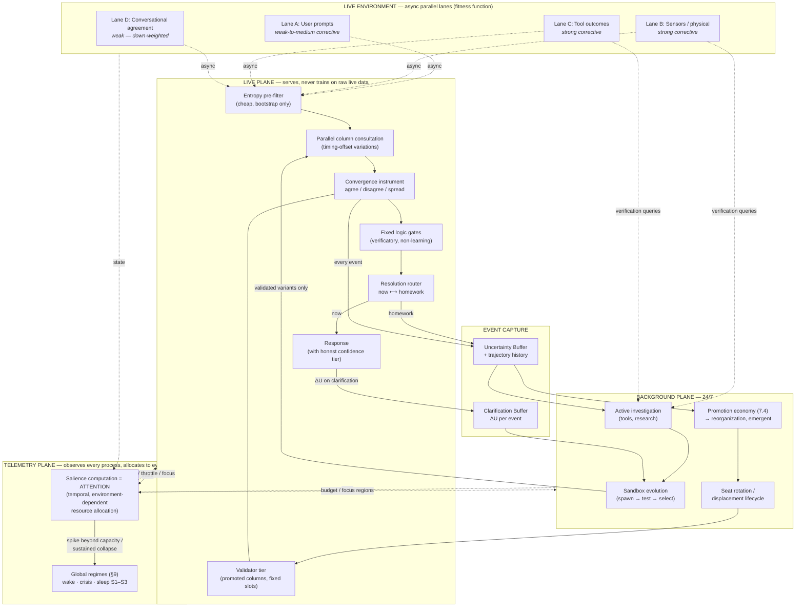

Reading order of the spine: lanes feed the pre-filter asynchronously → columns
answer in parallel → their **agreement is the uncertainty measurement** → gates
check coherence → the router decides now vs. homework → unresolved uncertainty is
the background plane's work queue → the background plane returns only
sandbox-validated improvements. The live system stays stable by construction.
Wrapped around all of it: the **telemetry plane** (§8) reads state from every
process and allocates resources back to every process — the system's attention.

---

## 3. Live Environment Lanes (Async Parallel Inputs)

### Purpose
The environment is the **first-order fitness function**. Keko is required to run
24/7-live because selection pressure is *sustained surprise on real incoming data*
— a batch-trained ensemble fixes its diversity at training time and stops being
tested; Keko stays in the selection regime indefinitely. The variation that "wins"
a region of input space is whichever one the live stream **stops generating
corrections for**.

### Mechanism
Lanes are independent async producers. Each event carries a **corrective-strength
weight** at ingestion, because the environment is only a fitness function where it
actually pushes back:

| Lane | Channel | Corrective strength | Why |
|---|---|---|---|
| A | User prompts & explicit corrections | Medium | Corrections are signal; raw prompts only expose gaps |
| B | Sensors / physical environment | **Strong** | Physics pushes back; not negotiable |
| C | Tool outcomes (Wolfram, search, code exec) | **Strong** | Verifiable claims get verified |
| D | Conversational agreement | **Weak** | Fluent agreement can drift unchallenged — down-weighted in selection |

Selection, replay priority, and sandbox fitness (§7) are all weighted by lane
strength. Without this weighting, variations can converge on fluent agreement that
nothing is testing.

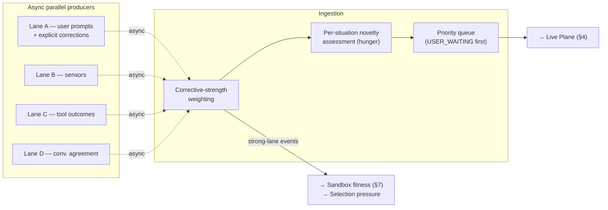

### Hunger (novelty appetite) lives here
Token hunger is **always-on and per-situation**, not a startup phase or schedule.
Each incoming event is scored for novelty *against what the system already has*:
novel → hungrier (more clarification, more investigation), familiar → quieter. One
signal yields per-axis appetite for free — a new task in a familiar domain is
hungry on the task axis while staying confident on the domain. When a lot is novel
at once (new deployment, new user, new household), the aggregate merely *looks*
like a coupling phase; there is no mode switch. Novelty is measured as "my
variations haven't converged here yet" — which is exactly the convergence signal
of §5 — and must be distinguished from the aleatoric floor, where asking is futile.

---

## 4. Inference Plane: Parallel Column Consultation

### Purpose
Columns are **timing-offset variations of the same competence**, not topic silos.
The end state is multiple independent specializations of the same regions of input
space, where *when* each column specialized makes it a distinct valid variation
(the deep-ensembles principle: diversity from different training trajectories).
Their agreement is the product the rest of the system consumes.

### Mechanism
1. Incoming event passes the cheap entropy pre-filter (bootstrap-era signal only).
2. All frontline columns are consulted **in parallel** (async tasks, §10 queue,
   ordered by §8 attention).
3. Outputs go to the convergence instrument (§5) — the columns are not just
   generators; their spread **is** the measurement.
4. The validator tier (promoted columns, §7) audits frontline answers in its
   regions; validator/frontline disagreement is itself a labeled training event
   (this keeps validators from going stale).

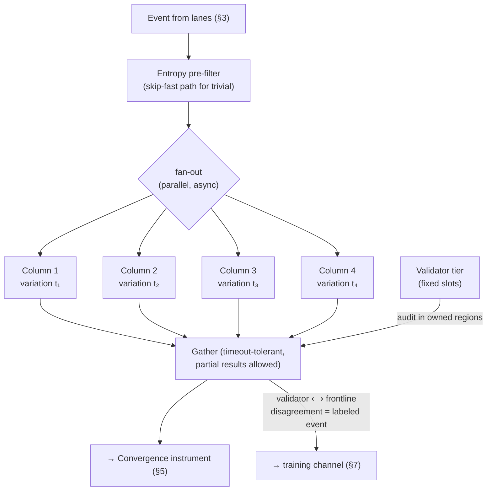

---

## 5. The Convergence Instrument (Uncertainty Measurement)

### Purpose
Produce the three-way verdict of §1. This replaces single-number entropy as the
system's uncertainty signal.

### Mechanism
Compare the independent variations' outputs (semantic / exact / fuzzy / structural
similarity, as in the existing multi-dimensional evaluator) and read the result
**together with its history**:

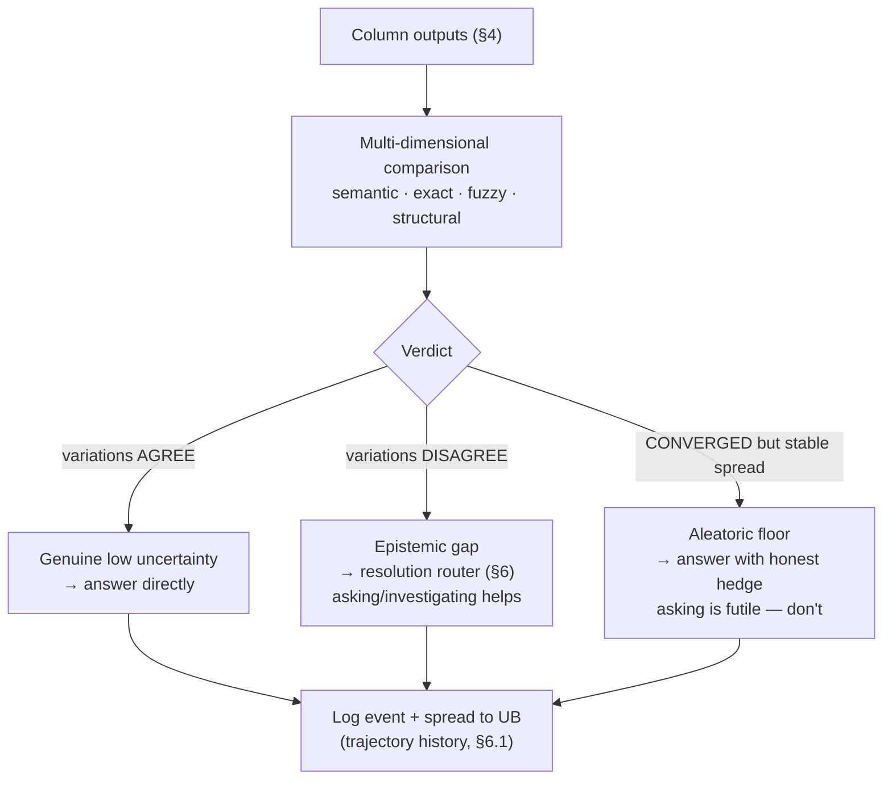

The third branch is load-bearing: a spread that has **stopped shrinking** over
repeated exposure is not a gap to grind on — it is the environment's irreducible
ambiguity, and the correct behavior is a calibrated hedge, not another clarifying
question. Distinguishing branch 2 from branch 3 requires per-region spread
*history*, which is why the buffers store trajectories, not snapshots.

---

## 6. Resolution Router: Gates In-Loop, "Now or Homework" Surfaced

### 6.1 Fixed logic gates (verificatory cores)
Columns are generative and learned — they drift, specialize, get promoted. The
gates (e.g. a syllogism evaluator) are **fixed and verificatory** — they don't
learn, they judge. Strict separation of propose vs. check. A gate verifies **form,
not truth** ("all birds fly; penguins are birds; penguins fly" is valid and false),
so passing earns "not incoherent," never "correct." Division of labor: gates =
internal consistency (cheap, always available); environment lanes B/C = premise
truth (expensive, intermittent, but the only thing that grounds premises).

Crucially, the gate sits **inside the resolution loop**, not as an output filter
at the end of the pipeline. A gate failure is not a discarded output — it **is**
unresolved uncertainty, and routes back into the background plane like any other
epistemic gap.

### 6.2 Now or homework
When the epistemic-gap branch fires and current capacity can't resolve it, the
routing decision is surfaced to the user as a **confidence tier**, not hidden:

- **Now** — stay interactive, clarify from the user this turn. Fast; uncertainty
  possibly unresolved. ΔU from the exchange is logged to the Clarification Buffer.
- **Homework** — queue to the 24/7 plane. Slow, but comes back grounded. Homework
  is itself tiered honestly:
  - **"I'll go verify"** — topic is tool/sensor-checkable (lanes B/C reachable);
    the homework premium is real.
  - **"I'll go deliberate"** — open-ended topic; the result will be more
    self-consistent but not necessarily more true, and the system says so.

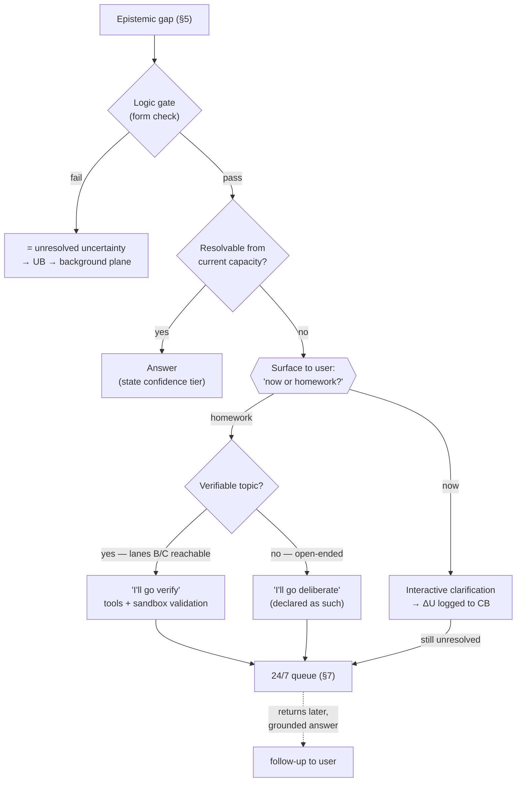

---

## 7. Background Plane (24/7)

The background process is not a "teacher loop" replaying buffers. It is three
coupled mechanisms sharing one work queue, running continuously at low priority
(throttled by GPU load as in v3's scheduler table).

### 7.1 Event capture with trajectory

UB/CB keep the v3 schemas (event_id, column_id, uncertainty_score, ΔU,
topic_hash, vector index, local→global tiering) with one structural addition:
**per-region spread history**. Every convergence verdict appends
`(timestamp, inter-column spread, lane, verdict)` to the region's trajectory.
This is what lets defrag and the floor-detector read *history instead of
snapshots* — the disambiguations in 7.2 and §5 are impossible without it.

### 7.2 Topological reorganization as emergent outcome (not a process)
There is no defragmentation daemon. Reorganization of the knowledge topology is
the **emergent equilibrium of the promotion economy** (7.4): when a column is
promoted on a topic, that region consolidates into the validator seat; the
displaced column re-enters the frontline at last priority and respecializes where
demand finds it; placement reorganizes continuously as a side effect of selection.
Content doesn't change — *placement* does — but nothing schedules it. The clean
region→column mapping is the annealed state of the competition, the same way a
self-organizing map gets topology from winner-take-all dynamics with no organizing
pass.

Two properties the emergent version must still guarantee, because the explicit
version got them for free:

- **Interference-awareness.** Emergent order is only as good as the fitness it
  anneals under. Promotion fitness must therefore be resolution success **net of
  interference** — a column's win in region A counts only after subtracting any
  uncertainty rise its specialization caused in its other regions (readable from
  the same telemetry; EWC-flavored). Without this term the economy converges to
  per-seat local optima and a globally fragmented topology.
- **Trajectory disambiguation, relocated into the promotion decision.** High
  inter-column similarity still has two opposite meanings, and the promotion
  economy is now what must tell them apart: *always-similar* columns (clones that
  never explored) are reclaimed — unfrozen and respecialized; *disagreement that
  shrank over time* is convergence — the near-zero state itself, protected and
  promotable. The trajectory history (7.1) is read at promotion time, not by a
  periodic scan.

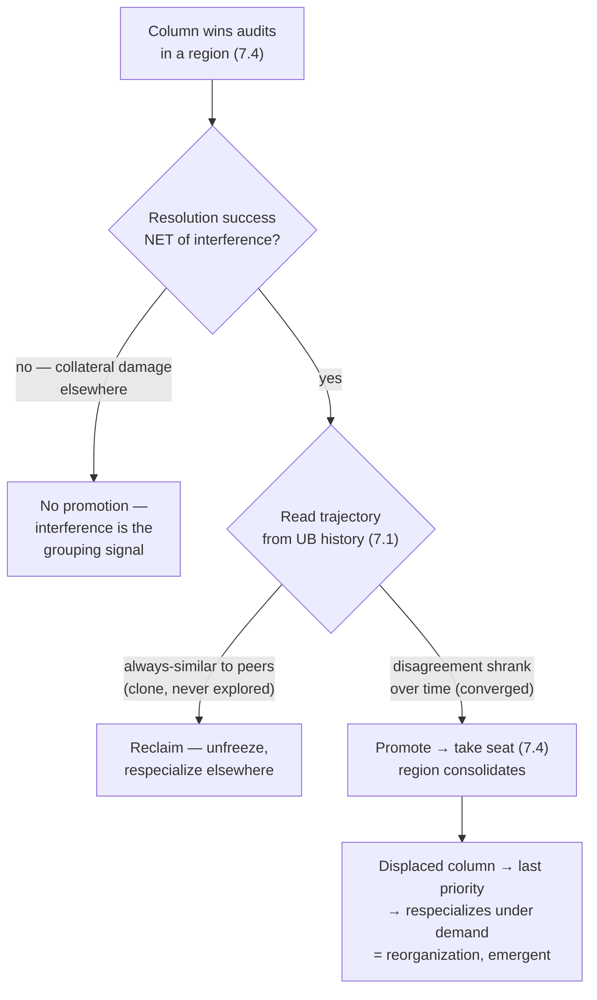

### 7.3 Active investigation + sandbox evolution
The loop **investigates**, it doesn't just replay. For queued homework and
high-value UB entries it runs tool-using workflows (lane C), researches, and
trains **candidate self-variants in a quarantined local sandbox**. Selection is
evolutionary: spawn variants → test against acquired evidence → promote only
variants that measurably reduce uncertainty on the held-out evidence → discard the
rest. Fitness is weighted by lane corrective strength (§3): evidence from sensors
and tools counts; unverified agreement barely does.

Safety property, by construction: **the live model never trains directly on
uncertain live interaction**. Only sandbox-validated improvements cross the
boundary. Experimentation is quarantined; the live system stays stable.

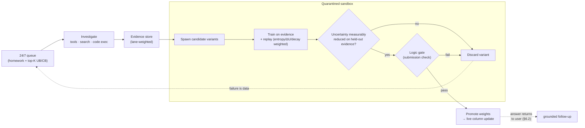

### 7.4 The promotion economy: rotating seat, displacement, adaptive ratchet
Standard MoE concentrates: the best expert gets more traffic and gets better.
Keko inverts it with a competitive rotation. Per topic there is **one validator
seat**; the rest of the columns are frontline, ordered by priority.

1. **Promotion by replacement.** When a frontline column demonstrably beats the
   current seat-holder, it takes the seat. The displaced validator is not retired
   — it re-enters the **frontline at last priority**, where live demand drives its
   respecialization. Roles circulate by displacement, so there is no promotion
   cascade and no permanent tier.
2. **Audits are the tournament.** The validator and a frontline column answer the
   *same inputs* during audits — a matched head-to-head comparison. Promotion
   evidence comes from won audits, not traffic share, so a column at last priority
   can still challenge the seat without extra exposure: the audit channel doubles
   as the fair trial. (Validator/frontline disagreement remains a labeled training
   event — the staleness fix — and promotion keys on **resolution success net of
   interference**, per 7.2, never on detection accuracy alone.)
3. **The adaptive ratchet.** When all three frontline columns drop below the
   uncertainty threshold on a topic — everyone is good, the instrument has
   saturated — the **threshold tightens** so competition over the seat continues.
   The bar is relative, Red-Queen style: holding the seat requires continuing to
   improve. This is what keeps the system permanently in the selection regime on
   topics it has "mastered."
4. **The ratchet is floor-gated.** Threshold adaptation halts at the aleatoric
   floor estimate from the convergence instrument (§5): the ratchet tightens only
   while per-region spread is still shrinking. Without this gate, the ratchet
   would tighten past the floor (or past the columns' capacity ceiling) and churn
   seat rotation forever on noise. Trajectory gates the threshold.
5. **Threshold adaptation is the slowest timescale.** Reorganization is
   event-driven (promotions can cluster), so the ratchet's time constant is
   enforced as the slowest in the §8 hierarchy — tighten on long averages, never
   on a brief dip of all three below the bar — or the ratchet itself becomes a
   ringing mode.

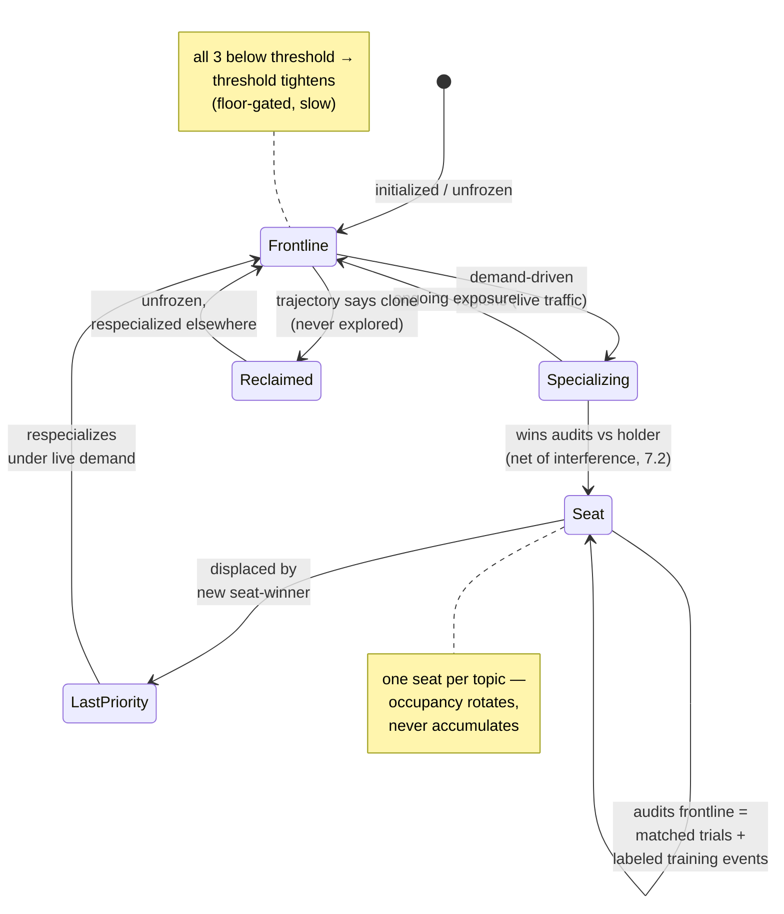

---

## 8. Telemetry Plane: Resource Manager and Attention Driver

### Purpose
Telemetry is not a dashboard. It is a single continuous stream emitted by every
process — GPU utilization and temperature, queue depths per priority tier, lane
activity rates, per-region convergence state and spread trajectory, novelty/hunger
scores, sandbox load, validator audit rates — and the telemetry plane closes the
loop by **allocating from that stream**. It is simultaneously the resource manager
for every process and the system's attention mechanism. Those are not two
functions that happen to share data; they are the same function. To attend to
something here *means* to assign it resources now.

### Attention, in the real sense
The word needs disambiguating from its transformer usage. Transformer attention is
a content-similarity weighting computed inside a forward pass: a learned,
mathematically-driven bias that is stateless across time and spends an identical
compute budget regardless of circumstances. The attention implemented in this
plane is the older meaning — a **temporal, environment-dependent variable** that
allocates *finite* processing capacity:

| | Transformer attention | Keko telemetry-attention |
|---|---|---|
| What it weights | Tokens within a context window | Processes, regions, lanes, queue entries |
| Where it lives | Learned weight matrices | Runtime state — no weights encode it |
| Time | Stateless per forward pass | Salience rises, decays, moves |
| Environment coupling | None — same compute always | Direct — lane activity and load reshape it |
| Budget | Fixed per pass | Finite and contested — attending to X starves Y |

Salience is computed per target (a region, a lane, a queued task) roughly as
`salience = f(lane corrective strength × novelty × convergence state × recency)`,
with decay over time and re-spiking on events: a sensor lane bursting, a region
whose converged spread starts growing again (drift alarm), a novelty flare from a
new task. The hunger signal (§3) is the *appetite*; telemetry-attention is what
converts appetite into actual moment-to-moment resource assignment. The same
internal state under a different environment produces a different allocation —
which is exactly what makes it environment-dependent rather than a fixed policy.

### The two roles, one mechanism

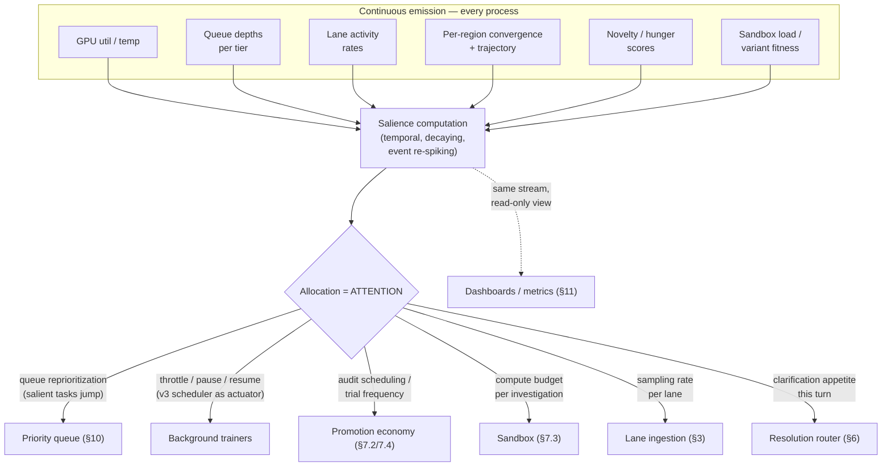

**As resource manager:** the v3 load-scheduler table (pause >80% GPU, throttle
40–80%, full rate <40%) is demoted from "the background process's config" to one
actuator among several of this plane. USER_WAITING preemption, sandbox training
budgets, defrag scan frequency, and lane sampling rates are all set here, from the
same salience signal, so the system degrades coherently under load instead of each
process throttling independently.

**As attention driver:** priority is never static. A region that was quiet for
weeks and suddenly shows growing spread gets background cycles *tonight*; a lane
that goes silent stops being sampled at full rate; a burst of novelty on one axis
pulls clarification appetite up on that axis while everything familiar runs cold.
What the system is "thinking about" at any moment is readable directly from the
allocation — attention is observable because attention *is* the allocation.

One structural consequence worth stating: observation and control share one
stream. The dashboards (§11) are a read-only view of the same signal that drives
allocation, which means the system cannot attend to anything its telemetry doesn't
measure — blind spots in emission are blind spots in attention. Instrumentation
coverage is therefore an architectural requirement, not an ops nicety.

---

## 9. Sleep-Equivalent States: Crisis and Idle Regimes

### Purpose
The attention plane (§8) describes continuous fractional reallocation under
normal load. Two boundary conditions break that regime, and both resolve the same
way: **full allocation of resources to cognitive-space processing**, with the
live-serving constraint lifted. In a crisis, because the problem at hand *is* the
work. In idle, because there is no one to serve. These are discrete global
regimes — the system's sleep equivalent — entered and exited by the telemetry
plane, not by a clock.

**Trigger logic (read from §8 salience):**
- **Crisis** — a salience spike that wake-regime fractional allocation cannot
  satisfy: a user request or environment demand whose resolution requires more
  than its queue-slot's worth of compute *now*.
- **Idle** — sustained salience collapse across all lanes, measured against the
  environment's *learned* baseline rhythm ("non-usual demand" — quiet at 3 a.m.
  is normal; quiet at 3 p.m. on a workday is the trigger).

### 9.1 Crisis regime (demand-triggered)
The processing pattern is **divergent search with diversity pruning**: spawn
multiple random variations of the solving approach in parallel, and ditch any new
variation that doesn't differ meaningfully from already-tried paths — no budget is
spent re-walking walked ground. This is the sandbox spawn-test-select machinery
(§7.3) run hot in the foreground at full resources, with two additions:

- **Tried-path memory.** Each attempted approach is fingerprinted (same trajectory
  infrastructure as §7.1) so the diversity prune has something to compare against.
  The prune criterion is distance from the tried set, not quality — quality is
  judged later by the convergence instrument.
- **Stop conditions from the instrument (§5):** stop when variations *agree*
  (solved — genuine confidence); or when the variation generator exhausts —
  successive spawns stop being novel relative to the tried set (genuinely stuck →
  declare it honestly, hand off to homework carrying everything the crisis run
  learned).

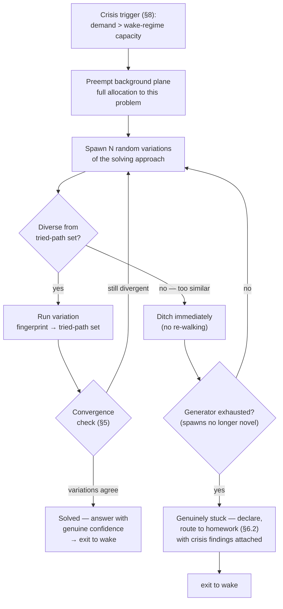

### 9.2 Idle regime (sleep, staged)
Entered on sustained quiet; deepens as quiet persists; **preemptible from any
stage** — a strong-lane event wakes the system instantly (USER_WAITING preempts
everything; the system is a light sleeper by construction). Stages mimic sleep
architecture, shallow-to-deep:

- **Stage 1 — housekeeping (light, NREM-analog).** Random automated maintenance
  processes: queue cleanup, merging duplicate UB/CB entries, applying temporal
  decay, compacting vector indices, checkpointing column states. Cheap operations,
  interruptible mid-task with nothing lost.
- **Stage 2 — consolidation.** The work that runs throttled all day runs
  unthrottled: dense audit/trial batches for the promotion economy (§7.2/7.4) and
  long sandbox training runs (§7.3) at full GPU budget. This is where the daytime
  budget contention of §8 disappears — the processes that wake-attention starves
  by design get their allocation here.
- **Stage 3 — replay (deep, REM-analog).** A **user-view replay** of accumulated
  experience: the system re-runs its own sandbox episodes and user interactions
  *from the user's perspective* — viewing its responses as the recipient received
  them, re-scoring them with hindsight it didn't have in the moment (later-turn
  information, post-hoc tool verification of claims it made unverified). The gap
  between what it said and what it now knows becomes labeled training events.
  This is self-evaluation from outside its own seat.

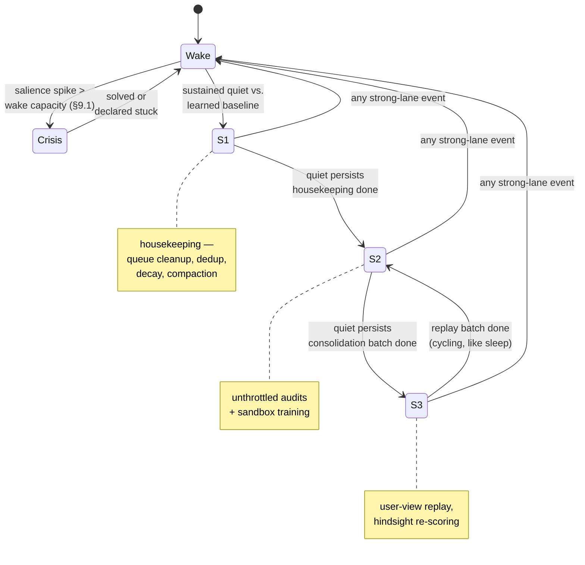

### Why replay closes a loop nothing else closes
Stage 3 is the only mechanism in the architecture that evaluates **interactions as
wholes** rather than tokens or regions — and it retroactively repairs the weakest
part of the fitness function. Lane D (conversational agreement) is down-weighted
in live selection (§3) because nothing tests it in the moment. Replay *can* test
it after the fact: claims made during the day get post-hoc verification against
lanes B/C overnight, upgrading weak-channel interactions into strong-channel
training data. The day's unverified fluency becomes the night's verified labels —
or its documented errors.

---

## 10. Async Orchestration Substrate

The execution layer is the existing priority-queue design (USER_WAITING →
TOOL_RESEARCH → COLUMN_QUERY → BACKGROUND), with the planes mapped onto it: lane
ingestion and column fan-out run at the top two tiers; investigation at
TOOL_RESEARCH; defrag, sandbox training, and lifecycle scans at BACKGROUND. Tier
membership is the static skeleton; **within and across tiers, ordering and
throttling are set dynamically by the telemetry plane (§8)** — the queue is the
attention system's primary actuator, not an independent scheduler. Partial
results on timeout are acceptable for the convergence instrument —
a verdict from 3 of 4 columns is a wider-error-bar verdict, not a failure.

---

## 11. Metrics and Meta-Supervision

Retained from v2/v3, with the signal source corrected. All metrics below are
**read-only views over the §8 telemetry stream** — the same signal that drives
attention, so what is reported and what is acted on can never diverge:

- **AUT** — average uncertainty per token, now computed from inter-column spread,
  not raw entropy.
- **URR** — uncertainty resolution rate, *per lane*, so weak-channel "resolution"
  (conversational agreement) can't inflate the headline number.
- **TSM** — temporal stability; rising drift in regions marked converged is the
  early-warning for validator staleness or environment shift.
- **Column complementarity** — interpreted through trajectory (7.2): low
  complementarity is failure only if the trajectory says clones.
- **Clarification efficiency** — ΔU per question asked; the hunger signal's
  calibration check (asking when the floor verdict was correct = miscalibration).
- **Homework yield** — split by tier: ΔU for "verify" homework vs. "deliberate"
  homework, kept honest and reported separately.
- **Crisis efficiency** — variations spawned vs. ditched vs. run per crisis, and
  solve rate; a rising ditch ratio means the variation generator is degenerating.
- **Sleep yield** — ΔU and labeled-event counts produced per sleep cycle, by
  stage; in particular, the volume of lane-D interactions upgraded to verified
  labels by Stage 3 replay (§9.2) — the measure of how much the night repairs
  the day's weak channel.

The MetaSupervisor consumes these to auto-calibrate thresholds, lane weights, and
promotion criteria — closing the loop at the level above the columns.

---

## 12. Through-Line

One requirement shows up in every section: **a single uncertainty number is
insufficient.** The architecture distinguishes *haven't-learned-yet* (epistemic —
asking and investigation help) from *can't-be-resolved* (aleatoric — back off),
and the instrument for that distinction is **inter-column variation convergence
read over time**, validated against the **corrective environment lanes** wherever
they reach. The lanes, the columns, the hunger signal, the gates, the promotion
economy (with reorganization as its emergent outcome), the sandbox, and the
now/homework choice are all
producers for — or consumers of — that one distinction. And the **telemetry plane
is what makes the distinction actionable**: knowing where the gaps are is inert
until something allocates finite capacity toward them, moment to moment, as the
environment shifts — which is what attention, in the real sense, is.

---

**End of Document** — *KEKO Architecture Specification v4 (Unified Edition)*
